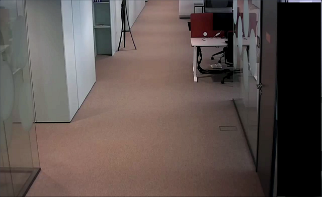
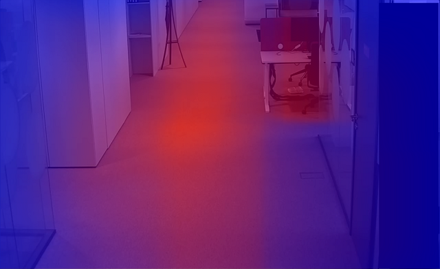

# Pedestrian Heatmap

A C# Console script/application that allows you to generate a heatmap using pedestrian data from a chosen camera.

Camera view  


Generated heatmap  


Overlayed camera view and the heatmap (not generated by the script)  


To run the script:
1. Open the **PedestrianHeatmap** directory in your IDE, such as Visual Studio Code
2. Ensure the necessary packages are set for the project. If not you can use the directives below. Open your terminal and run the commands:
```
dotnet add package GraphQL.Client
dotnet add package GraphQL.Client.Serializer.Newtonsoft
dotnet add package Newtonsoft.Json
dotnet add package System.Drawing.Common
```
3. Set your SmartFace installation's IP or hostname
```
string serverUrl = "http://<server-ip-or-hostname>/graphql/";
```

4. Set your camera's id. You can find it within your server's swagger. Use the endpoint **GET** /api/v1/Cameras and the value **id**.

```
string cameraId = "<camera-guid>";
```

5. Ensure the camera resolution matches the variables below:
```
int cameraSize_width = 1920;
int cameraSize_height = 1080;
```

6. Run the application
```
dotnet run
```